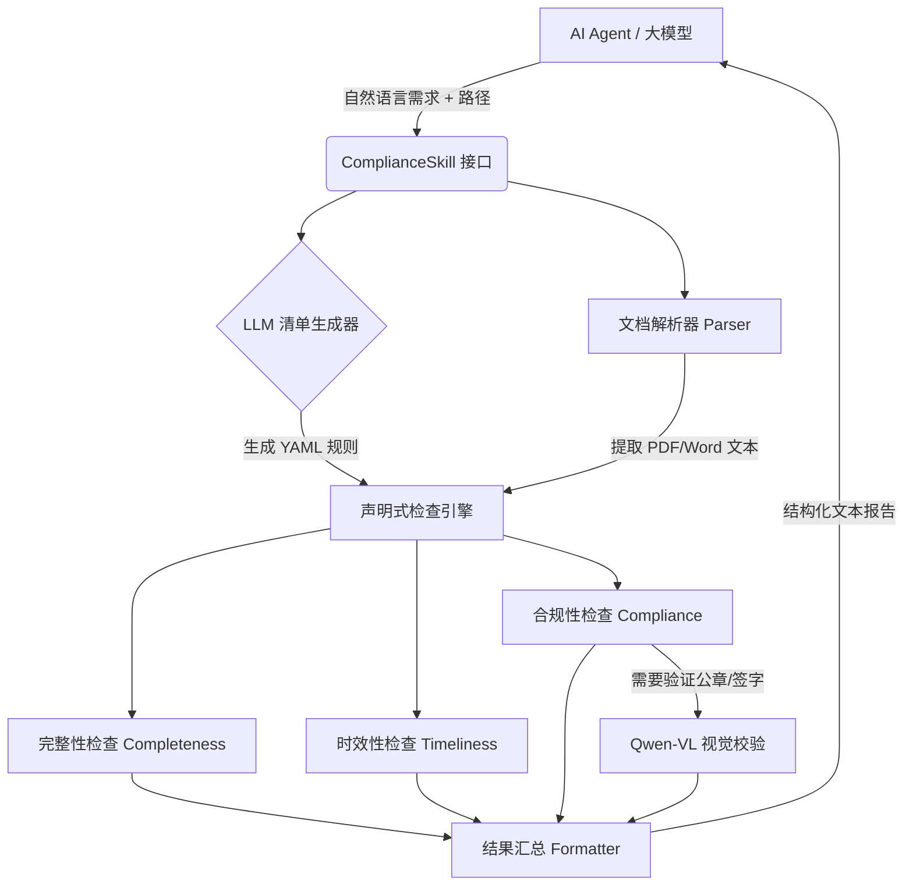

# Compliance Checker MCP Service

<div align="center">
  
[](https://www.python.org/)
[](https://opensource.org/licenses/MIT)
[](https://modelcontextprotocol.io/)
[](https://help.aliyun.com/zh/dashscope/developer-reference/vl-plus-quick-start)
[](https://github.com/psf/black)

**基于 MCP（Model Context Protocol）的 AI 驱动文档合规审查 Skill**

[中文文档](README.md) • [English](README_EN.md)

</div>

## 项目概述

本项目是一个 AI Skill，提供自然语言接口的文档合规审查能力：
1. **自然语言输入** - 用中文描述检查要求，自动生成检查清单
2. **资料完整性核对** - 检查必需文档是否齐全（支持语义匹配）
3. **资料时效性核对** - 验证文件有效期是否覆盖项目周期
4. **基础合规性核对** - 检查公章、签字、文件编号等要素
5. **视觉检测** - 使用 Qwen-VL 识别印章/签名
6. **文本输出** - 返回自然语言描述的检查结果

## 系统架构

本项目采用高内聚低耦合的声明式检查引擎架构：



## 项目结构

本项目采用 Clean Architecture 五层架构：

```
src/compliance_checker/
├── interface/                    # 接口层 - MCP 协议适配
│   └── mcp_server.py            # MCP Server 入口
│
├── application/                  # 应用层 - 用例编排
│   ├── skill.py                 # Skill Facade（对外接口）
│   ├── bootstrap.py             # 依赖注入初始化
│   ├── formatter.py             # 结果格式化
│   ├── use_cases/               # 用例实现
│   │   └── project_check.py     # 项目检查用例
│   └── prompts/                 # LLM 提示词模板
│       └── checklist_prompt.py
│
├── domain/                       # 领域层 - 业务逻辑
│   ├── checkers/                # 检查器实现
│   │   ├── completeness.py      # 完整性检查器
│   │   ├── timeliness.py        # 时效性检查器（4步判定规则）
│   │   └── compliance.py        # 合规性/视觉检查器
│   └── engine/
│       └── declarative.py       # 声明式检查引擎
│
├── core/                         # 核心层 - 数据模型与接口
│   ├── interfaces.py            # 抽象接口定义（Protocol）
│   ├── document.py              # Document 数据模型
│   ├── checklist_model.py       # Checklist 数据模型
│   ├── result_model.py          # 结果数据模型
│   ├── checker_base.py          # BaseChecker 抽象基类
│   ├── checker_registry.py      # 检查器注册表
│   ├── exceptions.py            # 统一异常定义
│   └── yaml_compat.py           # YAML 兼容层
│
├── infrastructure/               # 基础设施层 - 外部服务实现
│   ├── parsers/                 # 文档解析器
│   │   ├── pdf_parser.py        # PDF 解析
│   │   ├── docx_parser.py       # Word 解析
│   │   └── image_parser.py      # 图片解析
│   ├── llm/                     # LLM 客户端
│   │   ├── client.py            # OpenAI 兼容客户端
│   │   ├── config.py            # LLM 配置
│   │   └── semantic_matcher.py  # 语义匹配器
│   ├── visual/                  # 视觉检测模块
│   │   ├── qwen_client.py       # Qwen-VL API 封装
│   │   ├── region_detector.py   # 区域检测器
│   │   └── screenshot.py        # 截图工具
│   └── config/                  # 配置管理
│       └── settings.py
│
└── server.py                    # 应用入口
```

## 配置

### 环境变量

在 `.env` 文件中配置：

```bash
# 基础配置（必需）
LLM_API_KEY=your-api-key
LLM_BASE_URL=https://dashscope.aliyuncs.com/compatible-mode/v1  # 或 https://api.openai.com/v1
LLM_MODEL=qwen-max  # 或 gpt-4o

# 嵌入模型（可选，用于语义匹配文件名）
EMBED_MODEL=text-embedding-v1  # 留空则使用简单字符匹配

# 视觉模型（可选，用于印章/签名检测）
VISION_MODEL=qwen3-vl-flash  # 默认使用 OpenAI 兼容模式模型，留空则禁用视觉检查

# 独立配置（当嵌入/视觉模型与 LLM 使用不同厂商时）
# EMBED_API_KEY=your-embed-key
# VISION_API_KEY=your-vision-key

# OCR 配置（可选，默认不启用）
# OCR_BACKEND=none  # none（默认）/ paddle（本地）/ aliyun（云端）
```

### MCP Server 配置示例（Cherry Studio）

```yaml
# .openclaw/mcp.yaml
mcp_servers:
  compliance-checker:
    type: inline
    command: python -m compliance_checker.server
    cwd: /path/to/compliance-checker
    env:
      PYTHONPATH: /path/to/compliance-checker/src
```

## 安装说明

### 环境要求
- Python 3.10+
- LLM API Key（必需，用于清单生成和语义匹配）
- 视觉模型 API Key（可选，用于印章/签名检测，默认使用 LLM_API_KEY）
- OCR 服务（可选，用于扫描件识别，默认不启用）

### 安装步骤

#### 方式一：使用 pip 安装（推荐）

**步骤 1：创建并激活虚拟环境（venv）**

```bash
# 创建虚拟环境
python -m venv .venv

# Windows PowerShell 激活
.venv\Scripts\activate

# 或 Windows CMD 激活
.venv\Scripts\activate.bat

# 或 Linux/Mac 激活
source .venv/bin/activate
```

**步骤 2：安装依赖**

基础安装（最轻量，无 OCR）：
```bash
pip install -r requirements.txt
```

或使用 pyproject.toml 安装：
```bash
pip install -e .
```

带本地 OCR（PaddleOCR，体积大）：
```bash
pip install -e ".[local-ocr]"
```

带云端 OCR（阿里云，轻量）：
```bash
pip install -e ".[cloud-ocr]"
```

#### 方式二：使用 Docker 构建

支持通过构建参数 `OCR_BACKEND` 选择 OCR 配置：

```bash
# 基础镜像（无 OCR，最小化，推荐）
docker build -t compliance-checker:latest .

# 带本地 OCR（PaddleOCR，处理扫描件无需网络）
docker build --build-arg OCR_BACKEND=local -t compliance-checker:local-ocr .

# 带云端 OCR（阿里云 OCR，轻量需网络）
docker build --build-arg OCR_BACKEND=cloud -t compliance-checker:cloud-ocr .
```

运行容器：
```bash
docker run -e LLM_API_KEY=your-key \
           -e LLM_BASE_URL=https://dashscope.aliyuncs.com/compatible-mode/v1 \
           -e OCR_BACKEND=none \
           compliance-checker:latest
```

#### 配置环境变量
```bash
cp .env.example .env
# 编辑 .env 文件，填入你的 API 密钥
```

#### 运行测试
```bash
python run_check.py
```

## 使用方法

### 作为 Skill 使用（推荐）

```python
from compliance_checker.skill import ComplianceSkill

skill = ComplianceSkill()
result = await skill.check(
    project_path="/path/to/documents",
    requirements="检查是否有发票，验证日期是否在2026年3月10日前，检查是否有印章",
    project_period={"start": "2026-01", "end": "2026-12"}
)

print(result["issues_description"])  # 查看检查结果
```

### 作为 MCP Server 使用

配置 `.openclaw/mcp.yaml`：
```yaml
mcp_servers:
  compliance-checker:
    type: inline
    command: python -m compliance_checker.server
    cwd: /path/to/compliance-checker
    env:
      PYTHONPATH: /path/to/compliance-checker/src
      LLM_API_KEY: ${LLM_API_KEY}
```

然后使用自然语言调用：
```
检查 /path/to/documents 文件夹中的发票，验证日期是否有效，是否有印章
```

## 核心功能

### 1. 自然语言输入

用中文描述检查要求，LLM 自动生成检查清单：
```python
requirements = """
审查建设工程项目，需要立项批复、环评批复、施工许可证，
检查所有批文是否有公章，证件是否在有效期内
"""
```

### 2. 完整性核对

检查必需文档是否齐全：
- **精确匹配**：文件名包含清单名称
- **语义匹配**：使用 LLM 嵌入模型计算相似度（默认阈值 0.75）

### 3. 时效性核对

验证文件有效期：
- 提取签发日期、有效期起止
- 支持多种日期格式
- 判断有效期是否覆盖项目周期
- 支持有效期描述提取（如"有效期一年"）

### 4. 合规性核对

检查基础合规要点：
- **公章**：视觉检测
- **签字**：视觉检测
- **文件编号**：正则匹配
- **日期**：提取验证

### 5. 视觉检测

使用 Qwen-VL 进行视觉确认：
- 自动为印章/签字检查启用视觉检测
- 返回检测结果和置信度
- 无需文本关键词匹配

## 快速测试

```bash
# 测试发票检查
python run_check.py
```

或使用 Python：
```python
import asyncio
from compliance_checker.skill import ComplianceSkill

async def test():
    skill = ComplianceSkill()
    result = await skill.check(
        project_path="./docs",
        requirements="检查是否有发票，验证日期是否有效，是否有印章",
        project_period={"start": "2026-01", "end": "2026-12"}
    )
    print(result["issues_description"])

asyncio.run(test())
```

## 技术特点

- **自然语言接口** - 无需编写 YAML，用中文描述检查要求
- **LLM 驱动** - 自动生成检查清单，语义匹配使用 LLM 嵌入 API
- **视觉优先** - 印章/签名检测使用 Qwen-VL，不依赖文本关键词
- **轻量级** - 默认无 OCR，可选安装 PaddleOCR/阿里云 OCR
- **异步架构** - 所有检查任务并行执行
- **Docker 支持** - 支持构建参数化镜像，灵活配置 OCR 后端

### 注意事项

### 1. OCR 配置
- **默认不启用**（`OCR_BACKEND=none`），仅处理可编辑 PDF
- **本地 OCR**：安装 `[local-ocr]`，配置 `OCR_BACKEND=paddle`
- **云端 OCR**：安装 `[cloud-ocr]`，配置 `OCR_BACKEND=aliyun` + 阿里云密钥

### 2. 日期格式
支持的日期格式：
- `2024年3月15日`
- `2024-03-15`
- `2024/03/15`
- `2024年3月`（自动补全为 3月31日）

### 3. 视觉检测
- 默认使用 `qwen3-vl-flash` 模型，可通过 `VISION_MODEL` 修改
- 自动复用 `LLM_API_KEY` 和 `LLM_BASE_URL`（OpenAI 兼容模式）
- 如需使用不同厂商的视觉模型，可配置 `VISION_API_KEY` 和 `VISION_BASE_URL`
- 首次调用可能有延迟

### 4. 语义匹配
- 使用 LLM 嵌入 API（默认 text-embedding-v1）
- 默认相似度阈值：0.75
- 支持备用方案（字符级嵌入）

### 5. LLM 依赖
- 清单生成需要 LLM API
- 语义匹配优先使用 LLM 嵌入
- 支持 OpenAI 兼容 API（DashScope、Moonshot 等）

---

**项目状态**: MCP Service 版本已稳定 ✅  
**最后更新**: 2026-03-15  
**维护者**: evob

## 架构特点

- **Clean Architecture 五层架构**: Interface → Application → Domain → Core → Infrastructure
- **依赖倒置**: 内层定义接口，外层实现接口
- **依赖注入**: 通过 `bootstrap.py` 完成所有依赖组装
- **声明式检查引擎**: 根据清单配置自动执行检查
- **时效性 4 步判定**: 提取有效期 → 提取落款日期 → 确定基准时间 → 核心判定矩阵
